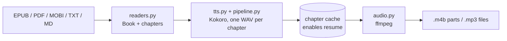

# lectr

Turn DRM-free e-books into audiobooks on your own computer. `lectr` reads EPUB, PDF,
MOBI/AZW3, plain text, and Markdown, narrates them with the local
[Kokoro-82M](https://huggingface.co/hexgrad/Kokoro-82M) text-to-speech model, and writes an
`.m4b` audiobook with chapters, cover art, and metadata — or one `.mp3` per chapter. No cloud
services, no API keys, no GPU required.

> **Status:** in development, not yet released. Commands below describe the v1 design in
> [`docs/superpowers/specs/2026-09-26-lectr-design.md`](docs/superpowers/specs/2026-09-26-lectr-design.md).

## Getting Started

### Install

**macOS / Linux (Homebrew)** — installs ffmpeg and espeak-ng for you:

```bash
brew install <owner>/tap/lectr
```

**Any OS (uv)** — install [uv](https://docs.astral.sh/uv/), then:

```bash
uv tool install lectr
```

### Prerequisites (uv installs only)

| Tool | macOS | Linux (Debian/Ubuntu) | Windows |
|---|---|---|---|
| ffmpeg | `brew install ffmpeg` | `sudo apt install ffmpeg` | `winget install ffmpeg` |
| espeak-ng* | `brew install espeak-ng` | `sudo apt install espeak-ng` | [espeak-ng releases](https://github.com/espeak-ng/espeak-ng/releases) |

\* May not be needed if bundled by `kokoro-onnx`; to be confirmed before release.

The Kokoro model (~300 MB) downloads automatically on first use and is verified by checksum.
To fetch it ahead of time (e.g. before going offline):

```bash
lectr model download
```

### Usage

```bash
lectr convert book.epub                     # -> book title.m4b next to the book
lectr convert book.pdf --voice af_bella --speed 1.1
lectr convert book.mobi --format mp3        # -> one mp3 per chapter
lectr convert book.epub --chapters 1-2      # preview a voice on the first chapters
lectr chapters book.epub                    # show detected chapters
lectr voices                                # list voices
```

Long conversions **resume automatically**: if a run is interrupted, rerun the same command and
finished chapters are reused.

Books longer than 12 hours are split between chapters into `Title - Part 1 of N.m4b`, because
many players misbehave with very long M4B files. Change it with `--max-part-hours`.

### Configuration

Run the wizard once to save your preferred defaults:

```bash
lectr setup          # asks for voice, speed, format, output folder, ...
lectr config show    # shows each effective setting and where it came from
```

Settings are resolved as **command-line flag > config file > built-in default**. The wizard
writes `config.yaml` to your OS config folder
(macOS `~/Library/Application Support/lectr/`, Linux `~/.config/lectr/`, Windows `%APPDATA%\lectr\`),
which you can also edit by hand:

```yaml
voice: af_heart
speed: 1.0
format: m4b          # m4b | mp3
bitrate: 64
max_part_hours: 12
output_dir: null     # null = next to the book
cache_dir: null      # null = OS default
model_dir: null
keep_cache: false
overwrite: false
```

## Architecture

A three-stage pipeline; each stage is a single module that can be tested on its own.



Configuration (`config.py`, `wizard.py`) and the command line (`cli.py`) sit at the edge.
Architecture decisions will be recorded as ADRs in `docs/adr/`.

## Development

```bash
uv sync                      # create .venv with all dependencies
uv run lectr --help          # run from source
uv run pytest                # unit + integration tests (integration skips without ffmpeg)
uv run pytest -m e2e         # end-to-end with the real model (slow, downloads ~300 MB)
uv run ruff check && uv run ruff format --check && uv run mypy src
```

See [CONTRIBUTING.md](CONTRIBUTING.md) for workflow and conventions.

## Security

- Only DRM-free books are supported; DRM-protected files are rejected with a clear message.
- Model files are downloaded over HTTPS and verified against pinned SHA-256 hashes before use.
- ffmpeg is invoked with argument lists, never through a shell, so book titles and paths
  cannot inject commands.
- Config is parsed with `yaml.safe_load`; no network access other than the model download.

## Accessibility

`lectr` is a plain-text CLI: all status and errors are written as text (no color-only
meaning), progress is line-based so it works with screen readers, and `--quiet` suppresses
progress output entirely.

## Limitations

- English narration only (v1).
- No OCR: scanned PDFs without a text layer are rejected.
- PDF running headers/footers are read aloud; use `--chapters` to skip front matter.

## License

[GPL-3.0](LICENSE.md). lectr bundles the GPL-3.0 [`mobi`](https://github.com/iscc/mobi)
library for MOBI/AZW3 support. The Kokoro model is Apache-2.0.
